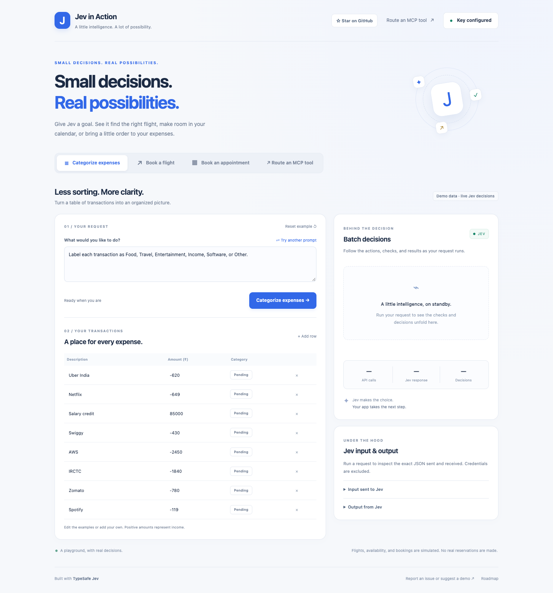

# Jev in Action

**Small decisions. Real possibilities.**

Four interactive demos of [TypeSafe Jev](https://docs.typesafe.ai): categorize expenses, choose a flight, find an appointment, and route a real MCP tool call. Bring your own API key, change a prompt, and inspect what the model received and returned.

Built for developers who want to see how structured AI decisions fit into an application. Plain JavaScript, an Express server, and a real local MCP server—no frontend build step.

[Get started](#quick-start) · [How it works](#how-it-works) · [Roadmap](#roadmap) · [Report an issue](https://github.com/jangya/jev-in-action/issues) · [Contribute](CONTRIBUTING.md)

If this helps you learn or build something, a GitHub star is appreciated. Have another use case in mind? [Suggest a demo](https://github.com/jangya/jev-in-action/issues/new?template=feature_request.md).



*The playground before a run; bring your own key to see live decisions.*

## What you can try

| Use case | Try asking | What happens |
| --- | --- | --- |
| **Categorize expenses** | “Treat streaming and music subscriptions as Entertainment.” | Edit up to 20 transactions; Jev categorizes them in one API request. |
| **Book a flight** | “Choose the cheapest available flight, even if it has one stop.” | Code filters a sample Bengaluru–Delhi schedule; Jev selects a match from eligible flights. |
| **Book an appointment** | “Find a time after 3 PM.” | Choose a date and service; Jev picks an available sample slot. |
| **Route an MCP tool** | “Show the billing release history in staging.” | Jev selects a tool and arguments from a discovered catalog. You can then execute it through a real MCP client. |

Each use case includes **Try another prompt**. The first three show an action trace, a result summary, and expandable Jev request/response JSON. MCP routing also offers optional LLM comparison, a benchmark, saved history, and JSON export.

**Real model decisions, sample application data.** Flight schedules, appointment availability, and MCP service records are fixtures. Booking confirmations are simulated; no flight or appointment is actually booked. The MCP protocol connection and tool calls are real. The application never substitutes fake model responses when a key is missing or a provider fails.

## Quick start

You need **Node.js 22 or newer**, npm, and a TypeSafe API key with access to Jev. See the [TypeSafe documentation](https://docs.typesafe.ai) for account and API setup. An OpenRouter key is optional.

```sh
git clone https://github.com/jangya/jev-in-action.git
cd jev-in-action
npm ci
npm run dev
```

Open [localhost:3000](http://localhost:3000).

1. Click **Add API key** in the header. If a server key is already present, the button says **Key configured**.
2. Paste your TypeSafe key and save. No `.env` file is required for this path.
3. Start with **Categorize expenses**, then click **Categorize expenses →**.
4. Try another prompt, edit the input, and expand **Jev input & output** to inspect the exchange.

Without a key, you can explore the interface and MCP catalog. Model calls require credentials and may incur provider charges. “Key configured” means a key is present; your first run verifies access.

### Optional: compare with an LLM

In API settings, add an **OpenRouter API key** and optionally an **OpenRouter model** ID that supports tool calling. Then open **Route an MCP tool** and enable **Compare with an LLM**.

- Jev-only routing does not call OpenRouter.
- Comparison sends the same request, tool catalog, and policy to both providers, using their respective APIs.
- Comparison selects routes; it does not execute tools. Click **Execute Jev route** or **Execute LLM route** to make one MCP call.
- The expandable **20-request benchmark** uses both providers: 40 provider calls, zero tool executions.

The other three demos remain Jev-only.

### Optional: configure the server

```sh
cp .env.example .env
```

Edit `.env`, then restart your server. On Windows, you can copy the file using your editor or `Copy-Item .env.example .env` in PowerShell.

| Variable | Purpose | Default |
| --- | --- | --- |
| `TYPESAFE_API_KEY` | Server-side fallback Jev key | Empty |
| `TYPESAFE_MODEL` | Jev model | `jev-latest` |
| `OPENROUTER_API_KEY` | Optional comparison key | Empty |
| `OPENROUTER_MODEL` | Tool-calling model for comparison | `nvidia/nemotron-3.5-lightning:free` |
| `PORT` | Local server port | `3000` |

Model availability and access depend on the provider. Change the OpenRouter model if the default is unavailable. Browser-supplied keys and the OpenRouter model override server settings for that request.

## How it works

```text
Your goal + application state
            ↓
Local Express server builds typed questions
            ↓
Jev selects from defined choices
            ↓
Code validates the result
            ↓
UI shows the decision; you confirm any demo booking or MCP execution
```

Jev supplies a structured judgment; application code owns the constraints and execution.

- **Expenses:** one Choice question per transaction, evaluated together.
- **Flights:** code excludes sold-out flights and enforces budget, arrival, and stop limits. Jev selects among the remaining options using your prompt, with a no-match option.
- **Appointments:** code supplies available slots for the chosen date and service. Jev selects a suitable slot or returns no match. Times are IST.
- **MCP:** the server discovers five tools via `tools/list`. Jev selects the tool, service, and environment. The application validates those values before a user-triggered `tools/call`.

The MCP tools are `get_service_health`, `list_incidents`, `list_deployments`, `get_runbook`, and `list_feature_flags`. They accept `auth`, `billing`, or `search`, in `production` or `staging`. Unsupported requests can return `no_tool`.

For payload design, execution guarantees, and benchmark interpretation, read the [architecture notes](docs/architecture.md).

## Keys, data, and hosting

- UI keys use **sessionStorage** by default. **Remember on this device** switches to **localStorage**, which persists after closing the browser. Both are browser storage, not encrypted credential vaults.
- Keys travel through your local server to the selected provider. They are not intentionally included in model payloads, saved results, or exports. Prompts and application state are sent to the provider.
- **Clear saved keys** removes browser keys; any `.env` keys still apply.
- MCP routing records and execution results persist in `.data/events.jsonl`, including request text and successful provider responses. JSON exports contain those records. The other three demos do not write results to that journal.
- `.env`, `.data/`, dependencies, and generated test artifacts are ignored by Git. Never paste credentials into prompts, issues, or screenshots.

**This release runs locally.** It binds to loopback and rejects foreign hosts. It is not a static site and is not ready for a shared public deployment: it has no multi-user authentication, per-user history isolation, or rate limiting. Do not expose a server containing your own provider keys. Hosted deployment is a roadmap item.

## Development

```sh
npm test

# Install Chromium once if Google Chrome is not available on macOS:
npx playwright install chromium
npm run test:browser
```

Tests use synthetic provider responses, so no API keys or paid model calls are needed. Browser tests start their own temporary local test server, exercise real MCP calls, and save screenshots to `test-artifacts/`. They do not verify live model quality. CI runs backend and browser checks on Node.js 22.

```text
public/                UI, shared sample data, browser key settings
server/demo.js         Flight, appointment, and expense workflows
server/routers.js      Jev and OpenRouter API adapters
server/mcp-*.js        Real MCP server and client
server/experiment.js   Routing comparison and single-execution logic
server/dataset.js      20 labeled MCP routing examples
test/                  Backend and browser checks
```

### Troubleshooting

| Problem | Try this |
| --- | --- |
| `npm run dev` fails | Check `node --version` (22+) and run `npm ci`. |
| Port already in use | Choose another `PORT` in `.env`, or use your existing server. |
| Key configured, but a run fails | Check key validity, model access, quota, and the displayed provider error. |
| No flight or appointment matches | Relax the goal or controls; a no-match result is supported. |
| Benchmark button disabled | Configure both TypeSafe and OpenRouter keys. |
| Browser changes are missing | Refresh. Restart your server after backend or `.env` changes. |

## Roadmap

These are proposed directions, not delivery commitments. [Open an issue](https://github.com/jangya/jev-in-action/issues/new?template=feature_request.md) to help prioritize them.

- [ ] More contributed demos with small, inspectable decision flows.
- [ ] A larger routing evaluation set, including ambiguous and unsupported requests.
- [ ] Optional MCP adapters backed by live services.
- [ ] A short walkthrough video and more examples of good no-match behavior.
- [ ] A hosted experience with appropriate credential handling, user isolation, and abuse controls.

Found a bug? [Report it](https://github.com/jangya/jev-in-action/issues/new?template=bug_report.md). Want to build on the project? Read [CONTRIBUTING.md](CONTRIBUTING.md). Small fixes, documentation improvements, and thoughtful demo ideas are welcome.

## License and credits

[MIT](LICENSE) · Built by [jangya](https://github.com/jangya).

Uses [TypeSafe Jev](https://docs.typesafe.ai), the [Model Context Protocol SDK](https://github.com/modelcontextprotocol/typescript-sdk), and optional [OpenRouter](https://openrouter.ai/docs) comparison. This is an independent community demo, not an official product of those providers.
